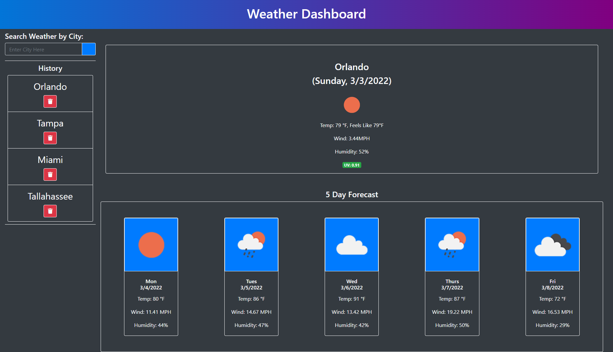

Weather Dashboard by Gerard Mennella

# Summary
This application is designed to search for the current weather of a given city, as well as a 5 day forecast.

# Code Breakdown
### HTML 
Jquery FontAwesome, and Bootstrap are called for this application

First, the header is created and styled using bootstrap and some css

Next, sections for the search and weather are created within the main section. Their layout is determined using bootstrap classes. In the search div there is an h2 element, a section for the search bar, and a section for the search history. The search input and button are styled using bootstaps input group classes and given unique Ids. The history section has an h2 and an empty ul element with a unique id to be populated using javascript.

Lastly, the forecast div has a section for the current weather as well as a 5 day forecast section. The current weather section has empty elements with unique ids to be dynamically populated with weather data using javascript. After that section is an h4 and an empty section for the 5 day forecast with bootstrap classes and a unique id to be dynamically populated using javascript

### JavaScript
At the top of the file my apiKey for openweathermap is declared as a variable

Next, the getCityWeather function is declared and the currentCity is passed as a parameter. This paramater is populated by the searched city name in a later function. This function contains the logic for the current weather and forecast data/display. openweathermap's url with the weather endpoint is declared as a variable then fetched. An If/Else statment is then created to check if the response was ok, if it is then json is called on the response to gather the data. If not then the else statement triggers an invalid response alert. From this data, the latitude and longitude data for the given city is gathered, assigned to variables, and passed into the appropriate parts of the next url call.

Next, the openweathermao api url with the onecall endpoint is declared, called, fetched, and parsed using json. This endpoint generates all data need for this application and more. The lat and lon variables are passed as variables in the url. The url also includes parameters to exclude unnecessary information and convert units to imperial so as to avoid math to convert kelvin to fahrenheit.

Using this data, variables are created for the necessary information. First, the date is retrieved and appropriate math is applied for the current accurate date. This date is then divided into seprate variables for it usable parts. After this the image for the relevant weather and its alt description are stored as variables. The temprature, wind speed, humidity and uv index are also retrieved and declared as variables. Math.floor is used to bring the temprature and feels-like temprature down to round numbers 

Jquery is then used to populate the text and attributes for the current weather display. Text is set with the data as variables and the images src and alt attributes are set as well. the url passes the code for the image in the appropriate position. An if/else statment is used to color code the uv index based on severity

Next, the forecast section is cleared and a for loop iterating through the next 5 days from the current day is added. This loop will generate 5 individual forecast divs and append them to the appropriate parent element. Similar variables to the ones above are declared from the daily data properties being iterated through. Elements are created for a forecast display, then approiate classes, attributes and text are assigned using javascript. These elements are appended to each other appropriately, then the appended to the forecast section.

After the getCityWeather function, the search history array variable is created using the history in local storage or an empty array if there is no history stored yet.

Next, A click listener function is applied to the search button using jQuery. At the top of this function a variable is set for the text input called searchedCity. Variables are also declared for a history list item, delete button, and an index. The getCityWeather function is called using the searchedCity variable as a parameter. jQuery is used to add attributes and classes to the li and button elements. The text and icons are then added to these elements and they are appended appropriately.

Click listener functions are added to the history item and its delete button. The pastSearch click listener on the list item runs the getCityWeather function using the clicked list items text as a parameter. The delete button removes the parent element (list item) from the history list and removes it from local storage as well. The displayHistory function is called to refresh the list and assign appropriate ids to each list item. At the end of the searchButton click function the searchedCity variable is passed to the searchHistory array, the array is added/updated to local storage, and the index used to assign a unique id to new li elements is increased by 1.

In the displayHistory function, the searchHistory list is cleared every time the function runs, then a for loop repopulates it with the current array stored in local storage. Similar variables to the ones in the previous function are declared with the same content and functions. This function uses the iterator to assign unique ids to each list item. The delete button functions the same and the displayHistory function calls itself within the click function to refresh the li item ids so they match the corresponding item in the array, to delete the approriate item.

Finally the displayHistory function is called at the buttom to display history on page load

### CSS
The css has a few minor font size and backround changes

# Deployed Application
https://gerardmennella21.github.io/Weather-Dashboard/

# Screenshot
